  

  <b>English</b> · <b>Русский</b> — every section is in both languages / каждый раздел на двух языках

## 👋 About · Обо мне

<table>
<tr>
<td width="50%" valign="top">

🇬🇧 Fullstack developer: I build a product end to end, from the database and backend to the interface.

- **Go** is my main language: microservices, gRPC/REST, high load, security.
- **C++** for systems work and performance: WebSocket servers, computer vision.
- **Python** for bots, scripts and serverless.
- **React + TypeScript** on the frontend.

</td>
<td width="50%" valign="top">

🇷🇺 Fullstack-разработчик: делаю продукт целиком, от базы данных и бэкенда до интерфейса.

- **Go** — основной язык: микросервисы, gRPC/REST, высокие нагрузки, безопасность.
- **C++** — системные задачи и производительность: WebSocket-серверы, компьютерное зрение.
- **Python** — боты, скрипты и serverless.
- **React + TypeScript** — фронтенд.

</td>
</tr>
</table>

## 🛠 Stack · Стек

| | |
|---|---|
| **Backend** |  |
| **Frontend** |  |
| **Data · Данные** |  &nbsp; MinIO (S3) |
| **Infra · Инфраструктура** |  |
| **Tools · Инструменты** |  &nbsp; gRPC · Protobuf · OpenAPI |

## 🚀 Projects · Проекты

<table>
<tr>
<td width="50%" valign="top">

### 🗳 [vote-service](https://github.com/1abobik1/vote-service)
🇬🇧 Backend for live TV polls: 100M viewers vote within a 60-second window; designed for ~500k RPS. 
🇷🇺 Бэкенд ТВ-опросов: 100 млн зрителей голосуют за 60 секунд, расчёт на ~500k RPS.

`Go` `PostgreSQL` `Redis` `Prometheus` `OpenAPI` `TypeScript`

</td>
<td width="50%" valign="top">

### 🔐 [SecureComm](https://github.com/1abobik1/SecureComm)
🇬🇧 Cloud storage with its own secure channel: RSA/ECDSA handshake, session keys, rate limiting; web, Go and Telegram clients. 
🇷🇺 Облачное хранилище со своим защищённым каналом: handshake на RSA/ECDSA, сессионные ключи, rate limiting; веб-, Go- и Telegram-клиенты.

`Go` `Next.js` `Python` `MinIO` `Redis` `PostgreSQL`

</td>
</tr>
<tr>
<td width="50%" valign="top">

### ☁️ [Cloud-Storage](https://github.com/1abobik1/Cloud-Storage)
🇬🇧 Zero-knowledge cloud storage: files are encrypted on the client, so only the owner can read them. 
🇷🇺 Облачное хранилище с нулевым разглашением: файлы шифруются на клиенте, прочитать их может только владелец.

`Go` `microservices` `JWT` `MinIO` `Redis` `Next.js`

</td>
<td width="50%" valign="top">

### 📦 [upload_file_service](https://github.com/1abobik1/upload_file_service)
🇬🇧 gRPC file upload service with S3 storage, rate limiting and integration tests. 
🇷🇺 gRPC-сервис загрузки файлов в S3-хранилище с rate limiting и интеграционными тестами.

`Go` `gRPC` `Protobuf` `MinIO` `Docker`

</td>
</tr>
<tr>
<td width="50%" valign="top">

### 💬 [Messenger](https://github.com/1abobik1/Messenger)
🇬🇧 Real-time messenger: C++20 server on uWebSockets, PostgreSQL, React client. 
🇷🇺 Мессенджер реального времени: сервер на C++20 и uWebSockets, PostgreSQL, клиент на React.

`C++20` `WebSocket` `PostgreSQL` `React`

</td>
<td width="50%" valign="top">

### 🙂 [FaceRecognizer](https://github.com/1abobik1/FaceRecognizer)
🇬🇧 Real-time face recognition from a webcam: Haar detector + LBPH model, people are remembered by ID. 
🇷🇺 Распознавание лиц с веб-камеры в реальном времени: детектор Хаара и модель LBPH, люди запоминаются по ID.

`C++20` `OpenCV` `CMake`

</td>
</tr>
<tr>
<td width="50%" valign="top">

### 🃏 [VocabTGBot](https://github.com/1abobik1/VocabTGBot)
🇬🇧 Completely free Telegram bot for learning English words with flashcards and AI generation, no server rent. 
🇷🇺 Полностью бесплатный Telegram-бот для заучивания английских слов по карточкам с ИИ-генерацией, без аренды сервера.

`Python` `Cloudflare Workers` `Workers AI` `GitHub Actions`

</td>
<td width="50%" valign="top">

### 🏆 [kokosBeerLove](https://github.com/1abobik1/kokosBeerLove)
🇬🇧 Prize-winning hackathon project: a platform for a football club, built by a team of four. 
🇷🇺 Призовой проект хакатона: платформа футбольного клуба, команда из четырёх человек.

`React` `TypeScript` `Django REST` `PostgreSQL` `Docker`

</td>
</tr>
</table>
