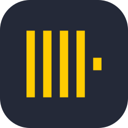
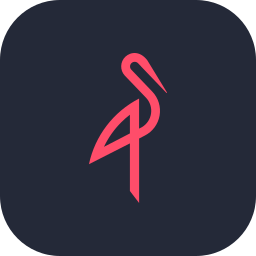
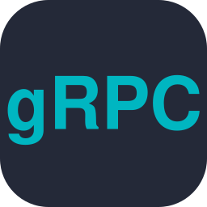
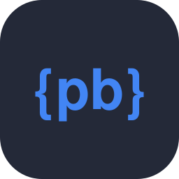
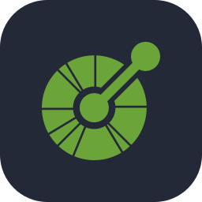

  

  <b>English</b> · <b>Русский</b> – every section is in both languages / каждый раздел на двух языках

## 👋 About · Обо мне

<table>
<tr>
<td width="50%" valign="top">

🇬🇧 Fullstack developer: I build a product end to end, from the database and backend to the interface.

- **Go** is my main language: microservices, gRPC/REST, high load, security.
- **C++** for systems work and performance: WebSocket servers, computer vision.
- **Python** for bots, scripts and serverless.
- **React + TypeScript** on the frontend.

</td>
<td width="50%" valign="top">

🇷🇺 Fullstack-разработчик: делаю продукт целиком, от базы данных и бэкенда до интерфейса.

- **Go** – основной язык: микросервисы, gRPC/REST, высокие нагрузки, безопасность.
- **C++** – системные задачи и производительность: WebSocket-серверы, компьютерное зрение.
- **Python** – боты, скрипты и serverless.
- **React + TypeScript** – фронтенд.

</td>
</tr>
</table>

## 🛠 Stack · Стек

| | |
|---|---|
| **Backend** |     |
| **Frontend** |        |
| **Data · Данные** |     |
| **Infra · Инфраструктура** |        |
| **Tools · Инструменты** |       |
